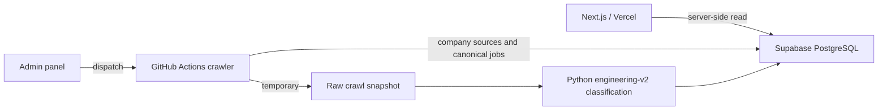

# Daily Berlin Jobs

[](https://github.com/umutyesildal/daily-berlin-jobs/actions/workflows/ci.yml)
[](LICENSE)

Daily Berlin Jobs is an open-source, consumer-facing Berlin engineering job
board. It combines a Python ATS/LinkedIn crawler, a versioned engineering
taxonomy, PostgreSQL, and a Next.js public application.

The current scope is tech engineering: software, data/AI, platform/cloud,
security, mobile, QA, and embedded/firmware/robotics. Mechanical, electrical,
civil, manufacturing, energy, and field/service engineering remain out of
scope. Python's `engineering-v2` taxonomy is the only classification authority.

## Architecture



PostgreSQL is the canonical store. Supabase is the recommended hosted provider,
but the project uses standard PostgreSQL URLs and SQL so it can also run on
Neon, Railway, Render, or a local container.

Only filtered public jobs are persisted. The large raw crawl stays ephemeral.
Full job rows have a rolling 30-day retention period; compact fingerprints are
kept longer to stop old or URL-mutated vacancies from being re-added as new.

## Run locally

Prerequisites: Docker, Python 3.12+, and Node.js 22+.

```bash
git clone https://github.com/umutyesildal/daily-berlin-jobs.git
cd daily-berlin-jobs
make setup
make dev
```

Open [http://localhost:3000](http://localhost:3000). The checked-in example uses
`USE_SAMPLE_DATA=true`, so the UI starts without cloud credentials. Change it to
`false` to read the local PostgreSQL database.

`make setup` creates ignored local env files, starts PostgreSQL, installs Python
and Node dependencies, and applies migrations. It does not need production
credentials.

Useful database commands:

```bash
.venv/bin/python scripts/db.py migrate
.venv/bin/python scripts/db.py doctor
.venv/bin/python scripts/db.py import-companies companies.csv
.venv/bin/python scripts/db.py import-companies catalog/companies.yaml --input-type yaml
.venv/bin/python scripts/db.py import-jobs /path/to/published_all_jobs.csv
```

## Data model and deduplication

| Object | Responsibility |
| --- | --- |
| `companies` | Maintainer-approved companies |
| `career_sources` | ATS label and career page configuration |
| `jobs` | Canonical rolling 30-day job payloads |
| `job_fingerprints` | Lightweight historical dedup keys |
| `job_url_aliases` | Historical canonical URL hashes for each fingerprint |
| `crawl_runs` | Publish counts, failures, and retention results |
| `public_jobs` | Public 30-day SQL view |
| `daily_jobs` | Today and yesterday in Berlin time |

Deduplication uses both a canonicalized URL and a normalized
`company + title + location` identity. Tracking parameters, fragments,
punctuation, casing, and diacritics do not create false new jobs. Unique indexes
and a transaction provide the final concurrency guard.

## Run the crawler

After importing company sources into PostgreSQL:

```bash
.venv/bin/python -m daily_jobs.main -t postgres
.venv/bin/python -m daily_jobs.post_process_jobs \
  --storage-backend postgres \
  --retention-days 30 \
  --include-linkedin-daily \
  --linkedin-raw-daily
```

The first command writes a single-run raw CSV snapshot. It replaces the prior
raw snapshot instead of accumulating history. The second command classifies and
filters every row before transactionally upserting only canonical public jobs.

During migration, `--storage-backend dual` can write PostgreSQL and the legacy
Google Sheet for comparison. Sheets are not used by the public web runtime.

## Supabase deployment

Create a Supabase project, apply migrations, and perform the one-time company
import. Configure:

### GitHub Actions secret

```text
SUPABASE_DATABASE_URL=postgresql://...session-pooler...
```

### Vercel server-side variables

```text
USE_SAMPLE_DATA=false
DATABASE_URL=postgresql://...transaction-pooler...
DATABASE_SSL=true
GITHUB_OWNER=umutyesildal
GITHUB_REPO=daily-berlin-jobs
GITHUB_WORKFLOW_ID=daily-update.yml
GITHUB_ACTIONS_TOKEN=github_pat_replace_me
ADMIN_PASSWORD_HASH=replace_with_a_password_hash
SESSION_SECRET=replace_with_a_long_random_secret
```

Never prefix database credentials with `NEXT_PUBLIC_`. The browser receives job
data, not credentials. The scheduled crawler, database backup, and Vercel app
use separate server-side connections.

Full instructions, one-time Sheet migration, quota thresholds, backup, restore,
cutover, and rollback are in [docs/DATABASE.md](docs/DATABASE.md). Component and
trust boundaries are in [docs/ARCHITECTURE.md](docs/ARCHITECTURE.md).

## Admin panel

The `/admin` route authenticates a maintainer and dispatches
`.github/workflows/daily-update.yml`. The crawler does not run in a Vercel
request. Only one workflow run is allowed at a time, and the UI polls GitHub for
progress.

Create a password hash without storing the plaintext password:

```bash
cd web
node -e "const c=require('crypto');const s=c.randomBytes(16).toString('hex');const h=c.scryptSync(process.argv[1],s,64).toString('hex');console.log(s+':'+h)" 'your-password'
```

## Tests

```bash
.venv/bin/python -m unittest discover -s tests -v
cd web
npm test
npm run typecheck
npm run build
```

CI also starts a clean PostgreSQL service, applies every migration, and checks
the schema. This catches clone/setup drift that sample-mode UI tests would miss.

## Contributing

Issues and focused pull requests are welcome. Start with [CONTRIBUTING.md](CONTRIBUTING.md),
[docs/COMPANY_CATALOG.md](docs/COMPANY_CATALOG.md), and the code of conduct.
Company suggestions are intake records: a maintainer checks duplicates, URL,
ATS support, Berlin relevance, and crawler compatibility before importing them.
Public submissions never write directly to production.

```bash
# Read-only catalog audit
.venv/bin/python scripts/catalog.py audit catalog/companies.yaml

# Trusted maintainer audit with public URL checks
.venv/bin/python scripts/catalog.py audit catalog/companies.yaml --check-urls
```

GitHub issues labeled `company-suggestion` are validated automatically. Only a
maintainer-applied `company-status:approved` label can trigger an idempotent
PostgreSQL sync. Rejected and disabled decisions retain an audit trail, and
disabling a company preserves historical jobs.

## Built with Codex and GPT-5.6

Daily Berlin Jobs existed before OpenAI Build Week, but it was substantially
developed during the submission period using Codex with GPT-5.6 as the primary
engineering partner.

Codex and GPT-5.6 helped:

- redesign job classification around the centralized, versioned
  `engineering-v2` taxonomy;
- migrate canonical job storage from Google Sheets to PostgreSQL and Supabase;
- design semantic and URL-based deduplication, transactional publishing, and
  retention policies;
- build the moderated company suggestion and approval workflow;
- package the Python crawler behind stable CLI entry points; and
- review and test the security boundaries between GitHub Actions, Vercel,
  Supabase, and the public Next.js application.

Codex accelerated repository analysis, implementation, debugging, and
verification across Python, TypeScript, SQL, and GitHub Actions. Key decisions
made with Codex included keeping PostgreSQL portable, making the Python pipeline
the single classification authority, retaining only filtered public jobs, and
preventing community submissions from writing directly to production.

Build Week work is visible in commits `bf663de`, `732542c`, `189dc4e`,
`0735699`, and `1200771`. The primary Codex build session is included in the
Devpost submission through its `/feedback` session ID.

## Security and license

Report vulnerabilities according to [SECURITY.md](SECURITY.md). Do not commit
database URLs, tokens, `.env` files, or service-account credentials.

Licensed under the [MIT License](LICENSE).
