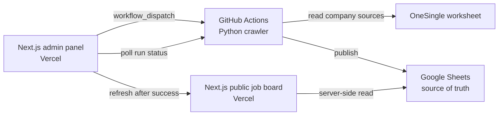

# Daily Berlin Jobs

Daily Berlin Jobs is a consumer-facing Berlin software job board backed by the
existing Python crawler and Google Sheets publishing pipeline.

The product is being migrated to a Next.js app hosted on Vercel. Google Sheets
is the canonical data store for the public website. The long-running Python
crawler stays outside Vercel and runs in GitHub Actions, either on a daily
schedule or when an authenticated admin clicks **Run Daily Update**.

## Product behavior

- **All Jobs** preserves the previous canonical collection and adds newly
  discovered Berlin software roles.
- **New Today** contains only jobs posted today or yesterday in the
  `Europe/Berlin` timezone.
- Empty or `Unknown` company, title, location, and date values are excluded from
  the fresh-jobs view.
- Duplicate company/title/location combinations are collapsed in the UI.
- LinkedIn daily results are included in the same publishing pipeline.

## Target architecture



### Responsibility boundaries

| Component | Responsibility |
| --- | --- |
| Next.js on Vercel | Public UI, search/filtering, admin login, run trigger and progress |
| GitHub Actions | Long-running ATS + LinkedIn crawl and post-processing |
| Google Sheets | Canonical published datasets |
| Python pipeline | Collection, normalization, filtering, deduplication and Sheets writes |

The crawler must not run inside a Vercel request. It can exceed function
duration limits, launches subprocesses, and produces intermediate files. The
Vercel API route should only authenticate the admin and trigger the GitHub
Actions workflow.

## Google Sheets model

The configured spreadsheet currently uses these worksheets:

| Worksheet | Purpose |
| --- | --- |
| `OneSingle` | Active company and ATS input configuration |
| `All Jobs` | Canonical cumulative Berlin software jobs collection |
| `Daily New Jobs` | Canonical today + yesterday collection |
| `Related Jobs` | Legacy/internal profile-fit output; not a public UI source |

The Next.js application should read `All Jobs` and `Daily New Jobs` directly on
the server. Browser code must never receive Google service-account credentials.

## Admin panel

The small `/admin` surface should provide:

- protected sign-in;
- one **Run Daily Update** button;
- current step and percentage;
- GitHub Actions run link and recent log summary;
- last successful update time;
- final public-page refresh after a successful run.

Recommended flow:

1. `POST /api/admin/run` validates the admin session.
2. The route calls GitHub's workflow-dispatch API for `daily-update.yml`.
3. The workflow runs the existing Python pipeline and publishes all worksheets.
4. `/api/admin/status` returns the GitHub Actions run status.
5. On success, the client refreshes the public data.

Only one active update should be allowed at a time. The run endpoint must reject
unauthenticated requests and duplicate in-progress runs.

## Environment variables

Copy the example for local development:

```bash
cp .env.example web/.env.local
```

Never commit `.env`, `.env.local`, service-account JSON, private keys, session
secrets, or GitHub tokens. Do not prefix secrets with `NEXT_PUBLIC_`; that prefix
exposes values to browser bundles.

### Next.js / Vercel

Configure these in **Vercel → Project → Settings → Environment Variables** for
Production, Preview and Development as appropriate:

```text
GOOGLE_SHEET_ID
GOOGLE_SERVICE_ACCOUNT_JSON
GITHUB_OWNER
GITHUB_REPO
GITHUB_WORKFLOW_ID
GITHUB_ACTIONS_TOKEN
ADMIN_PASSWORD_HASH
SESSION_SECRET
```

`GITHUB_ACTIONS_TOKEN` should be a fine-grained token limited to this repository
with **Actions: write** permission. `GOOGLE_SERVICE_ACCOUNT_JSON` remains
server-only. After changing Vercel variables, create a new deployment because
existing deployments do not receive the new values.

For local Next.js development, Vercel variables can later be downloaded with:

```bash
vercel env pull .env.local
```

### GitHub Actions secrets

The crawler workflow needs repository secrets for Sheets writes:

```text
GOOGLE_SERVICE_ACCOUNT_JSON
```

`GOOGLE_SHEET_ID` is non-secret project configuration and is currently declared
in the workflow. The service-account JSON must be added manually in GitHub under
**Settings → Secrets and variables → Actions**.

The spreadsheet must be shared with the service-account email. The workflow can
also use the repository's standard `GITHUB_TOKEN` for GitHub-native operations;
it does not need the admin panel's fine-grained token.

### Current Python compatibility

The Python pipeline currently accepts one of:

- `GOOGLE_SERVICE_ACCOUNT_JSON`
- `GOOGLE_SERVICE_ACCOUNT_FILE`
- `GOOGLE_APPLICATION_CREDENTIALS`

API-key credentials are read-only. Publishing requires service-account or
Application Default Credentials with Sheets write access.

## Current local application

Until the Next.js migration is complete, run the existing local UI from the
repository root:

```bash
python3 daily_berlin_jobs/server.py
```

Open [http://127.0.0.1:8765](http://127.0.0.1:8765).

The local **Run Daily Update** flow is:

1. collect ATS and LinkedIn jobs;
2. process and upload `All Jobs`, `Related Jobs`, and `Daily New Jobs`;
3. sync the canonical Sheets datasets back locally;
4. refresh the UI.

## Python pipeline

Install dependencies in a virtual environment:

```bash
python3 -m venv .venv
source .venv/bin/activate
pip install -r requirements.txt
```

Run the crawler using the configured Google Sheet:

```bash
.venv/bin/python job_scraper/src/main.py \
  "https://docs.google.com/spreadsheets/d/$GOOGLE_SHEET_ID/" \
  -t sheets \
  --input-worksheet OneSingle
```

Build and publish the consumer datasets:

```bash
.venv/bin/python job_scraper/src/post_process_jobs.py \
  --include-linkedin-daily
```

Pull canonical published data from Sheets:

```bash
.venv/bin/python job_scraper/src/pull_from_sheets.py
```

## Consumer filters

- **Level:** Intern / Working Student, Junior / Entry, Senior, Staff /
  Principal, Lead, Manager / Head / Director
- **Role:** Backend, Frontend, Fullstack, Data / AI / ML, Platform / DevOps /
  SRE, Security, Mobile, QA / Test, Product
- **Work mode:** Remote or Hybrid, Remote, Hybrid, On-site

Inspect the current distribution before changing public filters:

```bash
.venv/bin/python scripts/analyze_job_filters.py --source all --top 12
.venv/bin/python scripts/analyze_job_filters.py --source daily --top 12
```

## Tests

```bash
.venv/bin/python -m unittest discover -s tests -v
node --check daily_berlin_jobs/static/app.js
```

## Next.js application

The Vercel application now lives in `web/` and uses the App Router:

```bash
cd web
npm install
npm run dev
```

Configure Vercel with `web` as the project root directory. The public page reads
`All Jobs` and `Daily New Jobs` from Sheets on the server. `/admin` uses an
HTTP-only signed session and triggers `.github/workflows/daily-update.yml`.

Create an admin password hash without storing the plaintext password:

```bash
node -e 'const c=require("node:crypto");const s=c.randomBytes(16).toString("hex");process.stdout.write(`${s}:${c.scryptSync(process.argv[1],s,64).toString("hex")}\n`)' 'YOUR_PASSWORD'
```

Store the output as `ADMIN_PASSWORD_HASH`. Generate `SESSION_SECRET` with:

```bash
openssl rand -base64 48
```

## Remaining migration plan

1. Configure the GitHub Actions repository secrets.
2. Push this branch and validate a manual workflow run.
3. Create the Vercel project with `web/` as its root.
4. Configure Vercel variables and deploy Preview.
5. Validate Sheets reads and a manual `/admin` run.
6. Promote to Production and retire the local HTTP UI after parity is confirmed.

## Security rules

- No secret may be committed or exposed through `NEXT_PUBLIC_*`.
- Admin endpoints require a server-validated session.
- Use a hashed admin password and a strong random session secret.
- Keep the GitHub token repository-scoped with only `Actions: write`.
- Rate-limit the run endpoint and reject concurrent updates.
- Treat Google Sheets as the only published-data source of truth.

## Deployment references

- [Vercel environment variables](https://vercel.com/docs/environment-variables)
- [Vercel environment-variable CLI](https://vercel.com/docs/cli/env)
- [Vercel Function limits](https://vercel.com/docs/functions/limitations)
- [GitHub workflow-dispatch API](https://docs.github.com/en/rest/actions/workflows#create-a-workflow-dispatch-event)
- [Next.js `revalidatePath`](https://nextjs.org/docs/app/api-reference/functions/revalidatePath)
