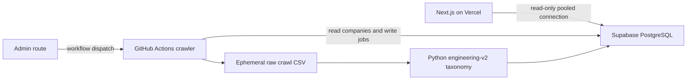

# Daily Berlin Jobs architecture

## Runtime flow

PostgreSQL is the canonical runtime store. Supabase is the hosted provider, but
the application uses a standard `DATABASE_URL`, SQL migrations, `psycopg`, and
`pg`; changing provider does not require a schema rewrite.

The crawler remains the only classification authority. Next.js reads the
published `role`, `level`, `work_mode`, `tech_stack`, `keywords`, and
`classification_version` fields and never recreates taxonomy rules.

## Stored data

| Object | Purpose |
| --- | --- |
| `companies` | Maintainer-approved companies |
| `career_sources` | Active ATS/career page configuration |
| `jobs` | Canonical public jobs from the last 30 days |
| `job_fingerprints` | Small dedup history without full job payloads |
| `job_url_aliases` | Every observed canonical URL hash for a fingerprint |
| `crawl_runs` | Operational counts and failures |
| `public_jobs` | Rolling 30-day public SQL view |
| `daily_jobs` | Today and yesterday in Berlin time |

The large raw crawl is an ephemeral build artifact. It is classified and
filtered before database writes; it is never copied into PostgreSQL.

## Deduplication contract

Every publish uses two SHA-256 keys:

1. a semantic identity from normalized `company + title + location`;
2. a canonical URL identity after removing fragments and tracking parameters.

Either key can reconnect a newly crawled row to an existing fingerprint. Every
observed URL hash remains as an alias, so A-to-B-to-A ATS link changes are also
caught. Database uniqueness constraints provide a final concurrency guard, and
the whole publish runs in a transaction.

The full job row expires after 30 days, based on `posted_at` when known and
otherwise `first_seen_at`. The compact fingerprint remains, so an old vacancy
cannot immediately return as a new listing after its full payload is deleted.

## Access boundaries

- Vercel receives a pooled, read-oriented connection string; it never exposes
  it to browser JavaScript.
- GitHub Actions receives the crawler writer connection string.
- Schema migrations are run by a maintainer/workflow connection.
- Community company suggestions remain GitHub issues or PRs until a maintainer
  validates and imports them. They never write directly to production.

## Failure and rollback

During cutover, `--storage-backend dual` can publish both PostgreSQL and the
legacy Sheet for comparison. Compare at least three successful daily runs, then
switch Vercel reads and the crawler to PostgreSQL. Rollback is a configuration
change back to the last Sheet deployment while the temporary dual-write window
is open. After acceptance, archive the Sheet read-only and remove its secrets.

See [DATABASE.md](DATABASE.md) for setup, migration, quotas, and backups.
