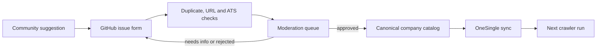

# Company and ATS catalog

## Goal

Grow the Berlin company source list with community help while keeping the
production crawler reliable. Public contributors should be able to suggest a
company without receiving access to Google Sheets or publishing directly to
`OneSingle`.

## Current production contract

The crawler currently reads active rows from the `OneSingle` worksheet:

| Field | Meaning |
| --- | --- |
| `Name` | Display name passed to scraper output |
| `Website` | Canonical company website |
| `Career Page` | Company careers or ATS URL |
| `Label` | Scraper/ATS identifier resolved by `JobCrawlerController` |
| `Description` | Optional company context |
| `Active` | Only `active` rows enter the crawl |

This worksheet remains maintainer-controlled.

## Contribution flow

The first release uses a structured GitHub issue form as the moderation queue.
A native website form can replace the intake surface later, but it must use the
same validation and approval states.

## Proposed canonical record

| Field | Purpose |
| --- | --- |
| `id` | Stable slug or generated identifier |
| `name` | Normalized company name |
| `website` | Canonical HTTPS website |
| `career_page` | Verified careers/ATS URL |
| `ats` | Canonical supported ATS label |
| `status` | `submitted`, `needs_info`, `verified`, `approved`, `rejected`, or `disabled` |
| `berlin_evidence` | URL proving Berlin hiring presence |
| `source_issue` | Public audit trail for the suggestion |
| `submitted_at` | Initial submission timestamp |
| `verified_at` | Last successful maintainer or automated verification |
| `notes` | Non-sensitive moderation context |

## Validation rules

Before approval, a suggestion must:

1. use valid HTTP(S) company and careers URLs;
2. deduplicate by normalized company domain and careers URL;
3. resolve to a supported ATS label or be marked for scraper work;
4. provide evidence of Berlin tech-engineering hiring;
5. return a usable careers page without credentials;
6. pass a small scraper smoke test before activation.

Unknown ATS suggestions are still valuable. They should create a separate
scraper-support task instead of being silently activated with the wrong label.

## Guardrails

- Anonymous submissions never write directly to `OneSingle`.
- Production Sheets credentials stay server-only and maintainer-only.
- Approval and rejection actions keep an audit trail.
- Native form intake must add rate limiting, spam protection, URL allow/deny
  checks, and duplicate detection before it writes to a queue.
- Removing or disabling a company must not delete its historical public jobs.

## Delivery phases

### Phase 1 — public intake

- GitHub company-suggestion issue form;
- public “Suggest a company” link;
- documented schema and moderation rules.

### Phase 2 — catalog health

- export a reviewed, non-sensitive canonical catalog from `OneSingle`;
- normalize ATS aliases into stable identifiers;
- add duplicate, URL, supported-scraper, and stale-source audits;
- report active, failing, unsupported, and unverified company counts.

### Phase 3 — moderated automation

- add a `Company Suggestions` queue or repository-backed catalog;
- validate suggestions automatically;
- let maintainers approve and sync verified records into `OneSingle`;
- expose status back to the original suggestion.

### Phase 4 — native public form

- add a small form to the website;
- preserve the same moderation states and audit trail;
- keep direct production writes impossible from the public client.
