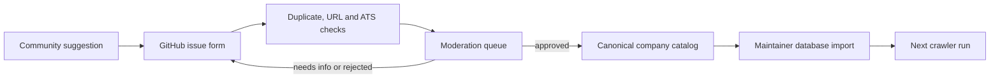

# Company and ATS catalog

## Goal

Grow the Berlin company source list with community help while keeping the
production crawler reliable. Public contributors should be able to suggest a
company without receiving database credentials or publishing directly to the
active `companies` and `career_sources` tables.

## Current production contract

The crawler reads active rows from PostgreSQL. The legacy `OneSingle` worksheet
is used only for the one-time migration:

| Field | Meaning |
| --- | --- |
| `Name` | Display name passed to scraper output |
| `Website` | Canonical company website |
| `Career Page` | Company careers or ATS URL |
| `Label` | Scraper/ATS identifier resolved by `JobCrawlerController` |
| `Description` | Optional company context |
| `Active` | Only `active` rows enter the crawl |

Production catalog writes remain maintainer-controlled.

Reviewed, non-secret catalog changes are versioned in
`catalog/companies.yaml`; `catalog/ats.yaml` lists canonical supported labels.
A maintainer imports approved YAML into PostgreSQL. The database remains the
runtime source used by the crawler.

## Contribution flow



The structured GitHub issue form is the moderation queue. The
`company-suggestion` workflow validates new and edited suggestions, publishes
the result back to the issue, and applies a stable status label:

- `company-status:needs-info`
- `company-status:verified`
- `company-status:approved`
- `company-status:rejected`
- `company-status:disabled`

A native website form can replace the intake surface later, but it must use the
same validation and approval states.

## Proposed canonical record

| Field | Purpose |
| --- | --- |
| `id` | Stable slug or generated identifier |
| `name` | Normalized company name |
| `website` | Canonical HTTPS website |
| `career_page` | Verified careers/ATS URL |
| `ats` | Canonical supported ATS label |
| `status` | `submitted`, `needs_info`, `verified`, `approved`, `rejected`, or `disabled` |
| `berlin_evidence` | URL proving Berlin hiring presence |
| `source_issue` | Public audit trail for the suggestion |
| `submitted_at` | Initial submission timestamp |
| `verified_at` | Last successful maintainer or automated verification |
| `notes` | Non-sensitive moderation context |

## Validation rules

Before approval, a suggestion must:

1. use valid HTTP(S) company and careers URLs;
2. deduplicate by normalized company domain and careers URL;
3. resolve to a supported ATS label or be marked for scraper work;
4. provide evidence of Berlin tech-engineering hiring;
5. return a usable careers page without credentials;
6. pass a small scraper smoke test before activation.

Unknown ATS suggestions are still valuable. They should create a separate
scraper-support task instead of being silently activated with the wrong label.

The verifier also rejects embedded URL credentials, non-HTTP(S) URLs, private
or non-public network targets, duplicate company domains, and duplicate careers
URLs. URL checks and scraper smoke tests run without database credentials.

## Catalog audit

Run the committed catalog audit without production credentials:

```bash
.venv/bin/python scripts/catalog.py audit catalog/companies.yaml
```

Add live public-URL health checks from a trusted maintainer environment:

```bash
.venv/bin/python scripts/catalog.py audit \
  catalog/companies.yaml \
  --check-urls \
  --output catalog-audit.json
```

The JSON report contains only normalized public catalog fields, status values,
and actionable findings. It never serializes database URLs, request headers,
service-account data, or environment variables. Statuses are `supported`,
`unsupported`, `stale`, `failing`, `unverified`, and `disabled`.

Canonical ATS identifiers and their human-facing or legacy aliases live in
`catalog/ats.yaml`. CI verifies that every canonical identifier maps to an
implemented scraper.

Maintainers can export the PostgreSQL catalog to a reviewed, non-secret fixture:

```bash
DATABASE_URL=postgresql://... \
  .venv/bin/python scripts/catalog.py export-postgres \
  --output catalog/companies.yaml
```

## Moderation and production sync

Opening or editing a suggestion can only produce verification comments and
labels. It cannot access the production database.

When a suggestion is `verified`, a maintainer may add the
`company-status:approved` label. The approval job repeats URL and scraper
verification, applies migrations, upserts the company and career source
idempotently, and records the source issue, actor, and timestamps in
`company_suggestions` and `company_suggestion_events`.

Adding `company-status:rejected` records a rejected decision. Adding
`company-status:disabled` records the decision and deactivates the matching
company and career source. Disabling a source does not delete its historical
jobs.

## Guardrails

- Anonymous submissions never write directly to production tables.
- Production database credentials stay server-only and maintainer-only.
- Approval and rejection actions keep an audit trail.
- Native form intake must add rate limiting, spam protection, URL allow/deny
  checks, and duplicate detection before it writes to a queue.
- Removing or disabling a company must not delete its historical public jobs.

## Delivery phases

### Phase 1 — public intake

- GitHub company-suggestion issue form;
- public “Suggest a company” link;
- documented schema and moderation rules.

### Phase 2 — catalog health

- [x] export a reviewed, non-sensitive catalog fixture from PostgreSQL;
- [x] normalize ATS aliases into stable identifiers;
- [x] add duplicate, URL, supported-scraper, and stale-source audits;
- [x] report active, failing, unsupported, and unverified company counts.

### Phase 3 — moderated automation

- [x] use structured GitHub issues as the `Company Suggestions` queue;
- [x] validate suggestions automatically;
- [x] let maintainers approve and sync verified records into PostgreSQL;
- [x] expose status back to the original suggestion.

### Phase 4 — native public form

- add a small form to the website;
- preserve the same moderation states and audit trail;
- keep direct production writes impossible from the public client.
